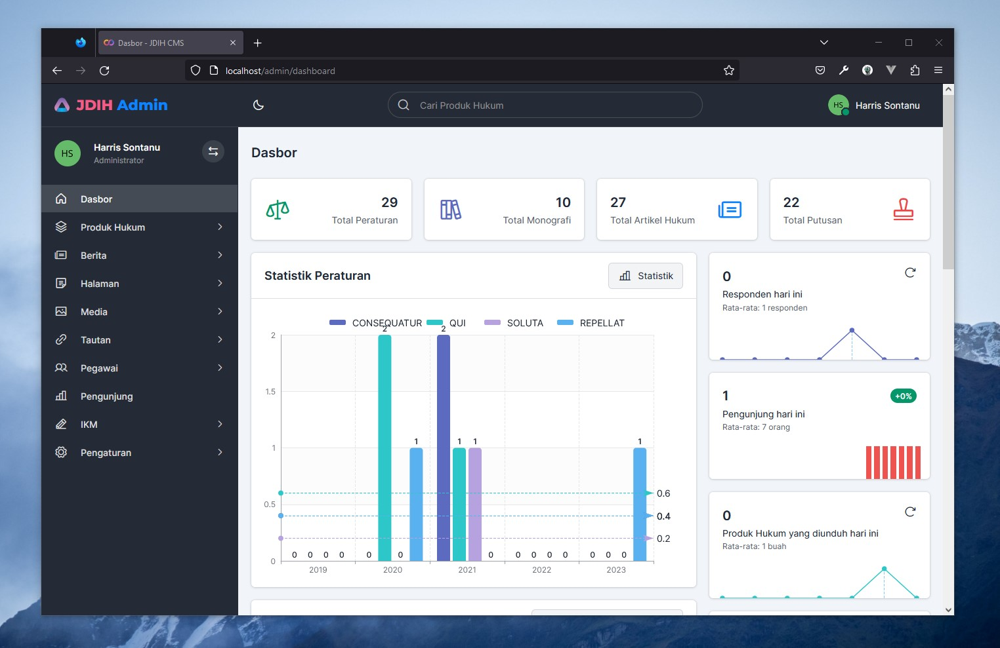

# JDIH CMS
A basic JDIH Content Management System application built with [Laravel 10](https://en.wikipedia.org/wiki/Hosts_%28file%29) and [Limitless Web App Kit](https://themeforest.net/item/limitless-responsive-web-application-kit/13080328) template.



## Installation

Clone the repo locally:

```sh
git clone https://github.com/harris-sontanu/jdih-cms.git jdih-cms
cd jdih-cms
```

Install App dependencies:

```sh
composer install
```

Setup configuration:

```sh
cp .env.example .env
```

Generate application key:

```sh
php artisan key:generate
```

Create an MySQL database and configure .env as needed. Next, run database migrations:

```sh
php artisan migrate
```
Create storage symbolic link:

```sh
php artisan storage:link
```

Run database seeder:

```sh
php artisan db:seed
```

Run the dev server (the output will give the address):

```sh
php artisan serve
```

You're ready to go! Visit JDIH CMS in your browser, and login with:

- **Username:** admin
- **Password:** password